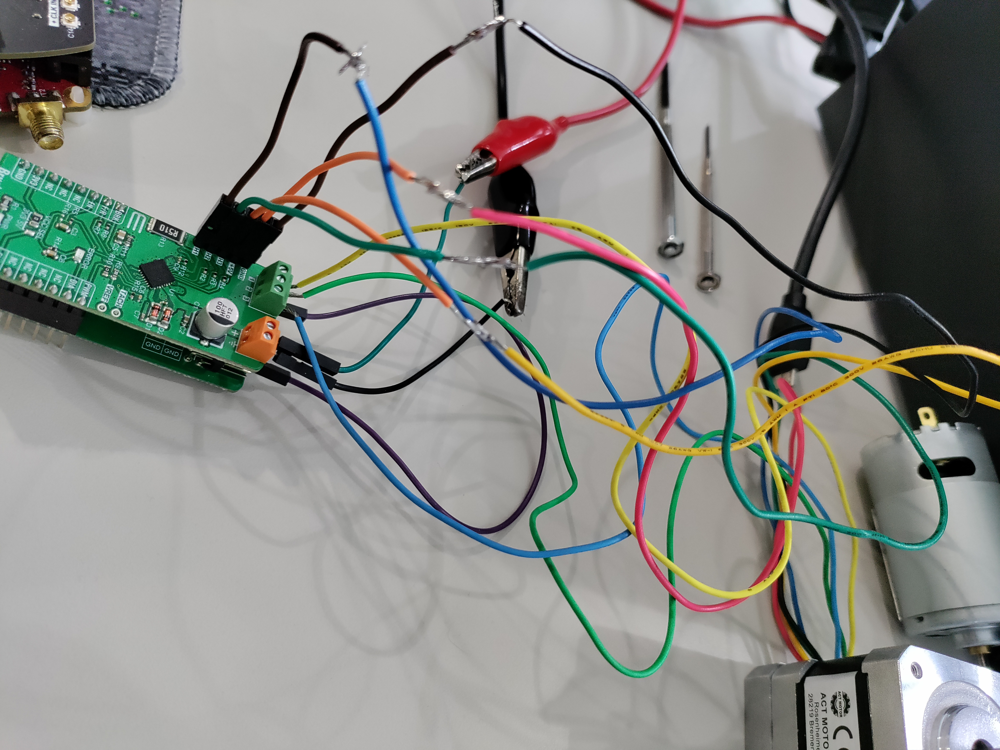

# Brushless 17 Click Demo (Red Pitaya)

This README explains how to run the **Brushless 17 Click** demo every 30 seconds on your Red Pitaya, along with what was done to complete the project.

---

## ✅ What Has Been Done

- ✅ Added [`brushless_17.py`](./Examples/python/brushless_17.py) to the `Examples/python/` folder
  - On the latest Red Pitaya OS 2.00, the following approaches **did not work**:
    - Modifying system GPIO files manually
    - Using the C API (which also touches those GPIOs)
    - Python macros provided by Red Pitaya
  - ✅ Only **direct register access using the Python API** worked successfully

- ✅ Added [`dc_motor.py`](./Examples/python/dc_motor.py) and [`gpio.py`](./Examples/python/gpio.py) as test scripts in the same folder

- ✅ Added systemd unit files for portability:
  - [`brushless.service`](./startup_runtime/brushless.service)
  - [`brushless.timer`](./startup_runtime/brushless.timer)

- ✅ Added [`initialize_startup.sh`](./initialize_startup.sh) for quick deployment and integration into Red Pitaya’s boot process

---

## ▶️ How to Run the Demo Every 30 Seconds

1. **Wire the motor and Click board as shown in the image**
   

   ### Motor Wires
   - **Yellow** → 1
   - **Green** → 2
   - **Blue** → 3

   ### Motor Base Wires
   - **Blue** → H1
   - **Green** → H2
   - **Yellow** → H3
   - **Red** → +5V
   - **Black** → GND

   ### External Power Supply
   - **Ground** → GND
   - **Output** → +

   ### Analog Pin Note
   - The **analog pin** should be wired to **3.3V (3v3)** using the **Terminal Click** and a **jumper**,
     since only the **AIN** pin is routed to the Click Shield.
     The **AN** pin cannot be set to HIGH directly.
2. Power up your Red Pitaya
3. Connect to it via browser
4. Go to **Development → Web Console**
5. Log in as:
   - **Username**: `root`
   - **Password**: `root`
6. Run the following commands:
   ```bash
   git clone https://github.com/IvanRuzavin/RedPitayaClickShield
   chmod +x RedPitayaClickShield/initialize_startup.sh
   ./RedPitayaClickShield/initialize_startup.sh

## 🛠 Useful Commands for Debugging

```bash
# View logs for the systemd service
journalctl -u brushless.service

# View output from the script itself
cat /tmp/myscript.log

# Check the current status of the systemd service
systemctl status brushless.service
